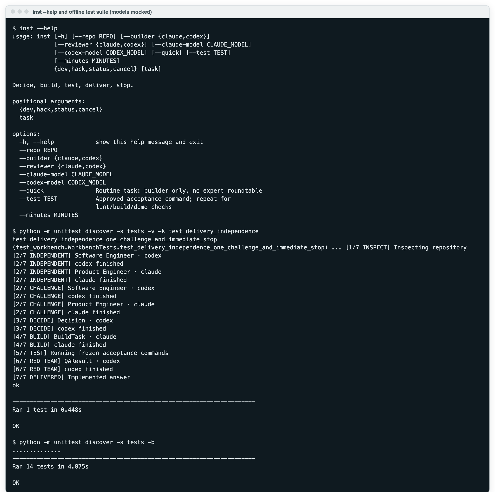

# Institutional Workbench

A personal Python CLI that uses Claude and Codex to decide, build, test and deliver
small repository changes. No browser or manual agent coordination.



*Real offline terminal capture ([raw text](docs/images/offline-run.txt)): `inst --help`, then the unit suite, where model responses are mocked (`FakeProvider`) against a synthetic fixture repository. No model was called.*

## System architecture



*Purple: model call · blue: deterministic code · green: human · amber: evaluation · grey: storage · dashed: external, optional, mocked or planned*

`inst dev|hack` refuses a dirty repository, creates an isolated Git worktree and
snapshots its visible text files. Two specialists report blind and challenge once,
the reviewer freezes a decision, and the builder returns complete changed files that
the host writes and tests with the frozen acceptance commands. One QA pass (which may
add regression tests) and at most two builder repairs follow; only then is the diff
checked with `git apply --check` and applied, uncommitted, to the original repository,
with every step logged under `.institutional-workbench/RUN_ID/`.

## How AI is used

- **Models and roles:** the local Claude CLI (`sonnet` by default) and Codex CLI
  (`gpt-5.6-terra` by default) run as `claude -p` / `codex exec` subprocesses for
  specialist reports and challenges, the decision, the build, one QA red-team pass and
  up to two repairs. Live runs need both CLIs logged in; `--quick` skips the
  specialists and gives the decision and QA to the builder.
- **Inputs:** the task, the dev or hack policy, and a JSON prompt with the repository
  snapshot plus earlier reports, decision, diff or test results as each step needs.
- **Outputs:** one JSON object per call, validated against pydantic schemas in
  `models.py`. Malformed output blocks the run; there is no retry or fallback model.
- **Tools and permissions:** Claude runs with `--tools ""` and no MCP servers; Codex
  runs read-only with tool features disabled, and any Codex tool attempt blocks the run.
  Only the host writes files: model output lands in the worktree, and the final
  checked patch is applied to the original repository.
- **Deterministic or human-controlled:** control flow, caps, path and protected-test
  checks, test execution and patch delivery are plain Python. You supply the task and
  (optionally) acceptance commands, and decide whether to commit the applied change.
- **Evaluation:** host-executed acceptance commands (`output/tests.json`) are the
  evidence of success; the unit suite mocks models and exercises real Git and subprocesses.
  Limits are listed under [Delivery and limits](#delivery-and-limits).

## Install

Requires Python 3.11+, Git, uv, and logged-in local Claude and Codex CLIs.
Developed against Claude 2.1.270 and Codex 0.154.0.

```sh
uv tool install git+https://github.com/retinapeg/institutional-workbench
```

From a local checkout: `uv tool install --editable .`

## Use

Enter a clean Git repository with an initial commit and installed test dependencies:

```sh
inst dev "Add a health endpoint and test it."
inst hack "We have three hours. Build X. Rubric: ... Sponsor stack: ..."
inst dev "Fix the date formatting" --quick
inst dev "Implement X" --builder codex --reviewer claude
inst dev "Implement X" --test "python -m pytest -q" --test "npm run build"
inst status
inst cancel
```

Claude Sonnet builds by default. Codex Terra decides and performs one QA pass.
Two specialists initially see only the same repository snapshot. One challenge
round follows, then the build decision is frozen. `--quick` uses only the selected
builder, including its decision and QA, for routine work.

Overrides: `--claude-model MODEL`, `--codex-model MODEL`, `--minutes 20`.
No workbench-controlled premium escalation; the Claude CLI may use auxiliary
models internally, and its reported model usage is logged. Hack mode uses the same engine with rubric,
demo, pitch and fallback priorities. Supply the actual event requirements.

Test commands are frozen before implementation. They are argument lists, not
shell scripts; use a checked-in script for pipes or compound commands.
Without `--test`, the CLI detects Python unittest/pytest under tests/, or npm test.
Install dependencies yourself first. Commands run in the isolated checkout;
the original repository's .venv/bin/python is reused when available.

## Delivery and limits

- Default 15 minutes/run, 90 seconds/model call, 120 seconds/test command.
- Maximum 16 model invocations, four specialists, one challenge round, one QA pass,
  two repair cycles and one focused builder question.
- Fixed control flow prevents another analysis round after the decision.
- Model output is schema-validated. The host writes complete changed text files.
  Models are instructed to use no tools; CLI tool attempts are rejected.
- Builds and tests run in an isolated Git worktree. The original must remain clean
  and at the same commit before a checked patch is applied. No reset, stash, commit,
  merge or push is performed on the target repository.
- Existing tests and independent QA regression files cannot be edited by the builder.
  QA critical findings require executable regression evidence; otherwise the run blocks.
- Success means acceptance commands passed and the bounded QA/repair gate completed.
  It is not proof of arbitrary user intent or production suitability.
- Ctrl+C or inst cancel terminates the current process group. Failed work is retained.
  There is no resume command: resolve the blocker and start a fresh bounded run.

Evidence lives in .institutional-workbench/RUN_ID/: run.json, events.jsonl,
reports/, output/tests.json, output/delivery.patch, and workspace/.
Add .institutional-workbench/ to the target project's .gitignore before committing.
Only intended edits are delivered; generated caches are excluded.

This is a small-repository tool: 180k characters of visible source maximum.
Text files above 60k, binaries, hidden files and key files are skipped. No file
deletion, dependency installation or hidden-file editing. Test commands are
locally trusted code, not a security sandbox. Models see selected repository text.

## Development checks

```sh
uv sync --python 3.11
uv run python -m unittest discover -s tests -v
uvx ruff check src tests
uvx mypy --python-executable .venv/bin/python src
uv build
```

Normal tests mock model responses but use real temporary Git repositories,
test subprocesses, file edits, cancellation and patch delivery.
See VERIFICATION.md for the completed live health-endpoint run and exact limitations.

## Research boundary

The separate [institutional-ai](https://github.com/retinapeg/institutional-ai)
research repository is frozen. Verified MVP main:
`5839bc65e2f041615d3256e9ce38bcd3c091d58a`.
Unfinished research preserved on codex/live-workers-v1:
`7c3cd71ff4b2f00bd206b049d80982bdc58f7187`.
This workbench reuses concepts, not that architecture. See FUTURE.md for deferred work.
